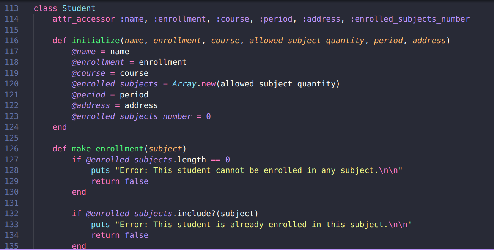
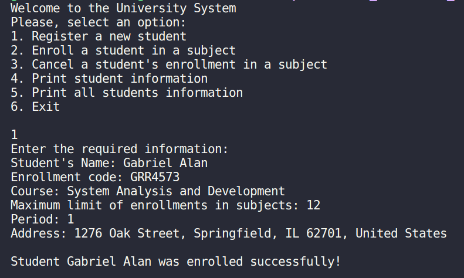

# school_enrollment_manager
This personal project simulates a university system for creating and managing student enrollment information. It includes validation checks to ensure data accuracy, such as verifying if a student is already registered before enrolling them. This beginner-level project serves as my introduction to Ruby programming, laying a solid foundation for future, more complex projects.

## Technologies Used
- Ruby

## Features
- Object-Oriented paradigm
- Student registration
- Enrollment management
- Cancellation of enrollments
- Querying student information

## Screenshots

  
  

